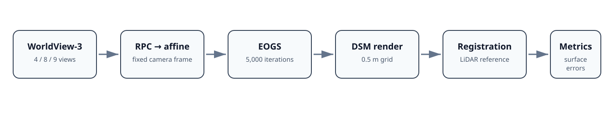
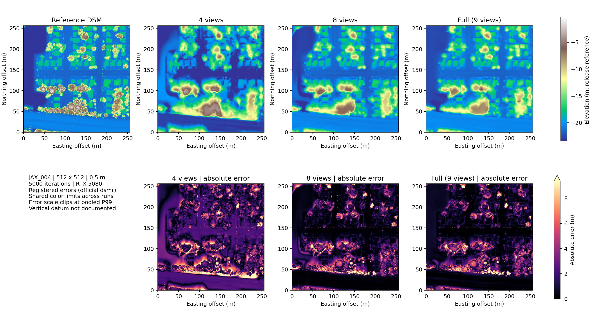
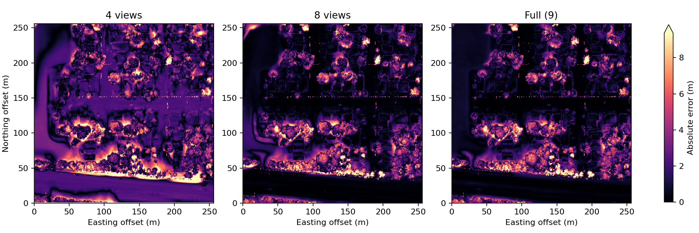
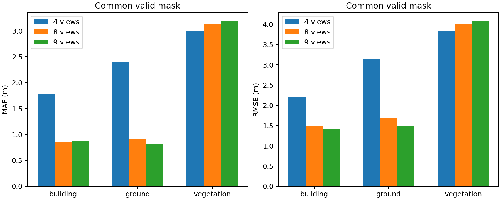
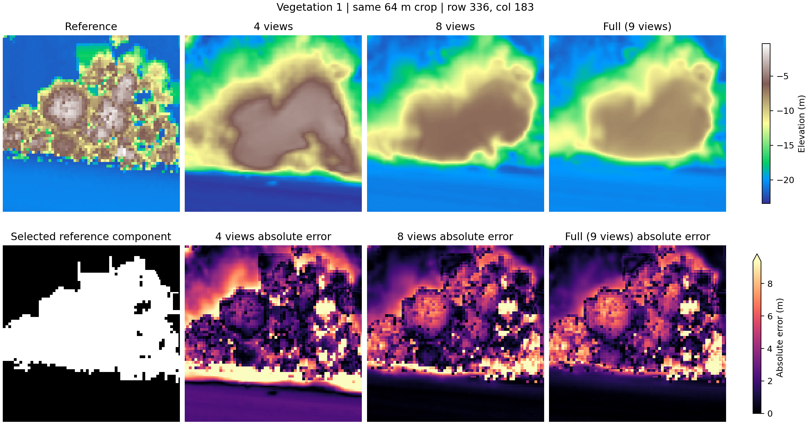

# View-Coverage Sensitivity of EOGS for Urban DSM Reconstruction

A controlled evaluation of Earth Observation Gaussian Splatting on multi-view WorldView-3 imagery, examining how satellite view coverage affects urban DSM accuracy.

## Research question

**How does the number of multi-view satellite observations affect the geometric accuracy of EOGS-based urban DSM reconstruction?**

We evaluate [EOGS](https://github.com/mezzelfo/EOGS) from the CVPR 2025 paper [*Gaussian Splatting for Efficient Satellite Image Photogrammetry*](https://openaccess.thecvf.com/content/CVPR2025/papers/Aira_Gaussian_Splatting_for_Efficient_Satellite_Image_Photogrammetry_CVPR_2025_paper.pdf) on `JAX_004`, a 256 m × 256 m Jacksonville, Florida scene from the DFC2019/US3D release. The scene contains nine training views and two held-out views. All experiments use 5,000 iterations, spherical-harmonic degree 0, native image resolution, a 0.5 m DSM grid, and the same LiDAR-derived reference.

## Key results

The table reports the RTX 5080 ablation on a **common valid mask of 260,610 pixels (99.41%)**, so every row evaluates the same locations.

| Train views | Overall MAE (m) | RMSE (m) | Building MAE (m) | Ground MAE (m) | Vegetation MAE (m) |
|---:|---:|---:|---:|---:|---:|
| 4 | 2.451 | 3.203 | 1.776 | 2.395 | 2.999 |
| 8 | 1.373 | 2.364 | 0.851 | 0.905 | 3.135 |
| 9 | 1.331 | 2.305 | 0.869 | 0.821 | 3.192 |

Increasing coverage from four to eight views reduced overall MAE by 44.0% and substantially improved rigid urban surfaces. The ninth view produced a smaller 3.1% MAE reduction. Vegetation remained the dominant failure mode across configurations. These are single-seed results from one scene and one nested subset design; they do not establish a general law of diminishing returns.

The DSM panels share one elevation scale, and the absolute-error panels share one clipped scale. Reported metrics use unclipped errors.

## Surface-specific behavior

Buildings and ground benefit most from added observations. Canopy surfaces remain smoothed, crown boundaries merge locally, and vegetation errors are much larger than errors over rigid surfaces.

See [failure analysis](docs/failure_analysis.md) for the evidence and its limits.

## Method

The pipeline converts RPC cameras to EOGS affine approximations, optimizes a 3D Gaussian representation, renders a DSM, registers it to the released reference with the official `dsmr` workflow, and computes overall and semantic-class metrics. The four-view subset maximizes minimum angular separation while retaining the original reference view; the eight-view set contains that subset; the nine-view run uses every training image. Held-out views are unchanged.

The experiments use upstream EOGS commit [`cca973e7ea512091b52c8ff741c80ddade5793d2`](https://github.com/mezzelfo/EOGS/commit/cca973e7ea512091b52c8ff741c80ddade5793d2) on branch `master`, plus two documented portability/correctness fixes in [code_changes.patch](code_changes.patch). No reconstruction method was added.

## Compatibility and the RTX 4060 baseline

The earlier nine-view baseline was independently completed on an RTX 4060 Laptop GPU and produced MAE 1.3546 m and RMSE 2.3189 m under its original per-run valid mask. The RTX 5080 nine-view run produced MAE 1.3321 m and RMSE 2.3076 m under the same per-run protocol. Scene, source snapshot, split, resolution, iterations, SH degree, registration, and evaluation scripts match.

The software stacks differ: the RTX 4060 used PyTorch 2.1.2/CUDA 11.8, while the RTX 5080 used PyTorch 2.7.1/CUDA 12.8. Cross-device bitwise determinism was not established, timing boundaries differ, and 4060 peak VRAM was not recorded. The small accuracy difference therefore cannot be attributed to either GPU. The 5080 common-mask table above is the controlled view-coverage result.

## Reproduce

The repository does not redistribute source imagery, reference/label rasters, checkpoints, or EOGS source files. Follow [the reproducibility guide](docs/reproducibility.md) to:

1. obtain the official data;
2. check out the exact EOGS commit and apply the patch;
3. prepare the affine cameras and nested view lists;
4. train, render, register, and evaluate each configuration.

Machine-readable results are in [results/metrics.csv](results/metrics.csv), [results/surface_metrics.csv](results/surface_metrics.csv), and [results/provenance](results/provenance). Exact view IDs are in [configs](configs).

## Limitations

- Only one Jacksonville tile, one seed, and one 4/8-view selection were evaluated.
- Satellite and LiDAR acquisition dates may differ; vegetation is temporally dynamic.
- The released local metadata does not establish the reference DSM vertical datum.
- Official registration estimates horizontal and vertical offsets and clips predictions to the reference range ±10 m; results are registered relative errors rather than independently verified absolute vertical accuracy.
- Results should not be generalized across Jacksonville, other cities, or forest canopy reconstruction.

## Data and licensing

WorldView-3 imagery and restricted DFC2019/US3D data are excluded. [data/README.md](data/README.md) links the official source and documents the expected local layout.

The [MIT License](LICENSE) applies only to material authored for this repository, including its wrappers, analysis scripts, documentation, and presentation assets. It does not license EOGS, its dependencies, or any dataset. EOGS is obtained separately from the [original repository](https://github.com/mezzelfo/EOGS) and remains subject to its authors' original terms; at the time of this audit, that repository did not declare an explicit GitHub license.

## Citation

Use [CITATION.cff](CITATION.cff) for this repository and cite the [original EOGS paper](https://openaccess.thecvf.com/content/CVPR2025/papers/Aira_Gaussian_Splatting_for_Efficient_Satellite_Image_Photogrammetry_CVPR_2025_paper.pdf) and [repository](https://github.com/mezzelfo/EOGS) when using its method or code.
